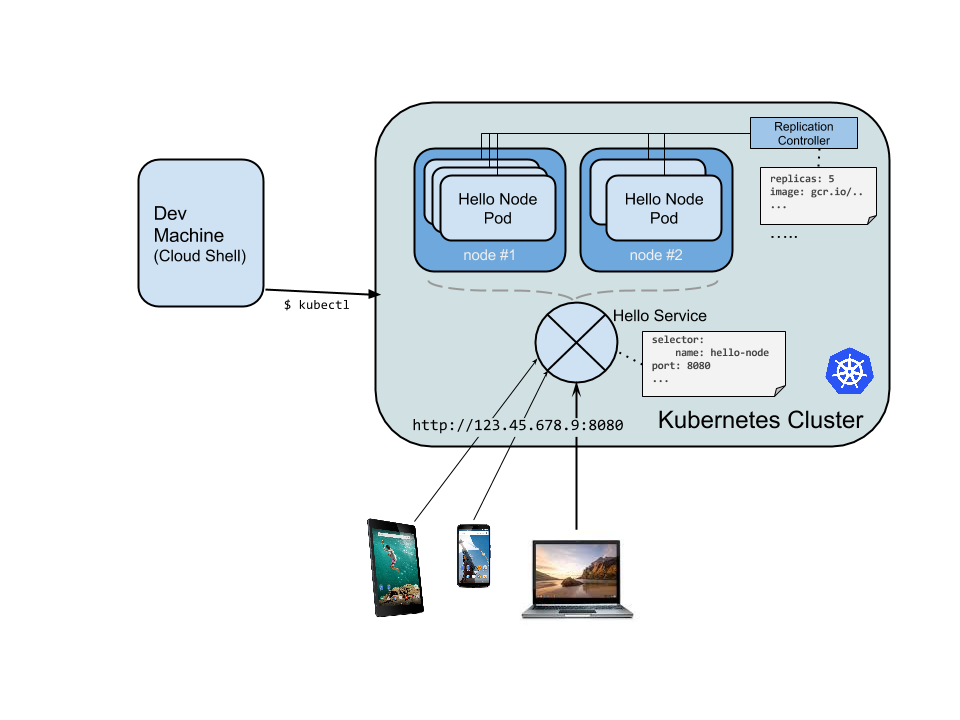
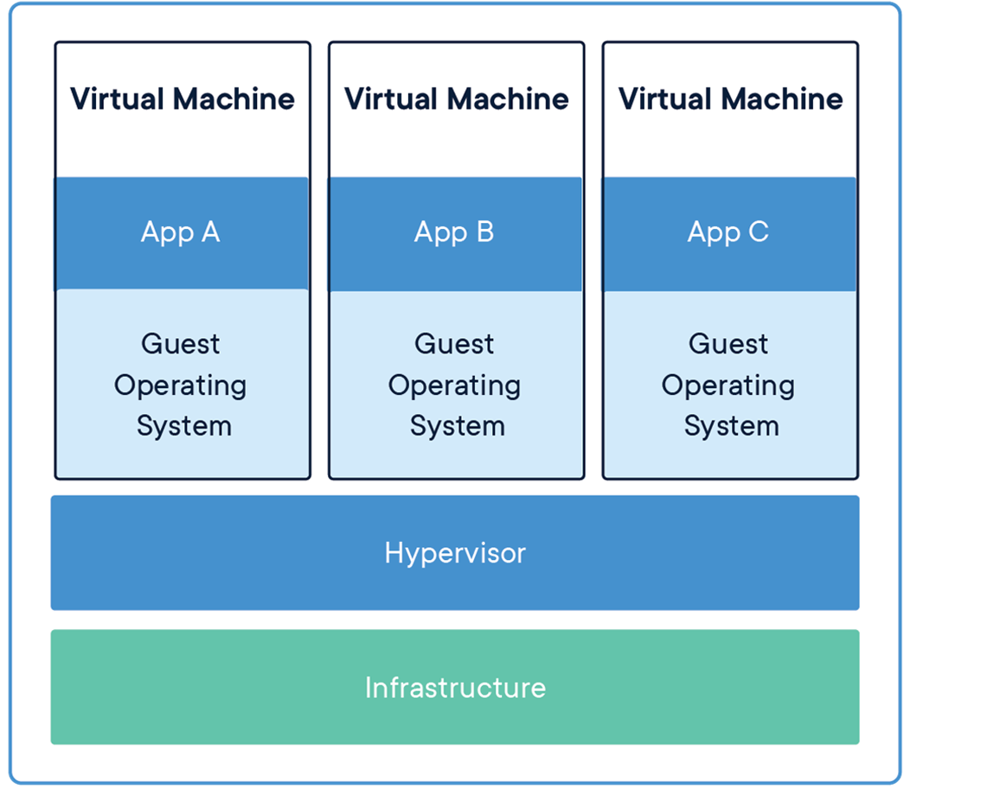

# Kubernetes for Beginners

Kubernetes (K8S) is a container orchestrator designed for applications that need the following things:

 - Service Discovery and Load Balancing
 - Automatic Bin Packing
 - Storage Orchestration
 - Self Healing
 - Secret and Configuration Management
 - Automated Rollouts and Rollbacks
 - Batch Execution
 - Horizontal Scaling

 > Source: https://kubernetes.io/

Kubernetes is optimized mostly for production environment where applications going down for a second or two is not required and there are a lot of things to monitor and manage.

Kubernetes otherwise called K8s is a big tool with a lot of fancy nobs and buttons, follow me on this guide to explain and demystify some basics of what Kubernetes is along with a short lab at the end to test all you'd see.

## Why Is It Used

In the general process of deploying applications, we encounter various issues with the way we want to get it working. One problem with deploying applications in production before Kubernetes and other container orchestrators was the problem of managing resources. If we needed an application, we spun up a thing called a VM. A VM is a full blown machine, we can otherwise refer to it as a Server. This machine in principle should only hold one application, including all its dependencies, which would have to be manually deployed via some CI process everytime we wish to use it. This process was very stressful and required a lot of technical skill to manage various things such as networking, security, storage and all that which would all go to waste if the VM became unresponsive and stopped working due to varying factors.

This is the reason for the mass adoption of Containers.

Containers provide a good level of isolation between the application and the machine running it. If the container running the application goes down, it doesn't affect the machine. Since this is the case, it means we can spin up as many containers on a single machine without any hopes of conflict.

Kubernetes provides this container management feature along with the ability to run multiple VMs in a cluster setup. Kubernetes is able to control these multiple machines by running a thing called a Control Plane which defines how the master and slaves communicate with each other.

```
The various parts of the Kubernetes Control Plane, such as the Kubernetes Master and kubelet processes, govern how Kubernetes communicates with your cluster. 

The Control Plane maintains a record of all of the Kubernetes Objects in the system, and runs continuous control loops to manage those objects’ state. 

At any given time, the Control Plane’s control loops will respond to changes in the cluster and work to make the actual state of all the objects in the system match the desired state that you provided.
```
> Source: https://kubernetes.io/docs/concepts/#kubernetes-objects

## Breakdown of Kubernetes Architecture


> Overview of a Kubernetes Setup

As explained before, we have two cluster types in Kubernetes since it is generally for handling distributed workloads:
 -  Master
 -  Slaves

A node is basically a VM in Kubernetes and a Cluster is a number of nodes working together. We will use this reference during the course of this article.

### K8S Master

This is what we use to talk to the slaves. In Kubernetes, the master is the one who we communicate to about what deployments should be on our cluster and how they should be managed. Just as the folk lore concept, the master delegates work to the slaves who are then responsible for starting the containers and making sure they function as desired.

The master does this using a collection of three processes:
 - apiserver
 - controller manager
 - scheduler

The apiserver is what we use to perform duties from a client. The control plane which was earlier explained is accessible to the outside world via this api server. From here, we can perform various operations inside and out of the cluster using a client tool called KubeCtl (Kubernetes Control) 
> Source: https://www.quora.com/What-does-the-ctl-in-kubectl-stand-for

The controller manager is what does all the checking and validation of the task which we sent to the cluster using the api server. So things like making sure our deployment doesn't fail and that the general health of the cluster and things running on it are in great shape. It does this by checking different resource objects on  Kubernetes in a continuous loop to ensure they function as expected.

The scheduler in finale, is what enforces rules on the cluster. In Kubernetes, because we run many applications in different containers, we do not want just one to take over all the resources like RAM, CPU, Storage etc. and undermine others. The scheduler is therefore the one that schedules these checks and ensures that any application joining on any slave is able to fit there, and if not, schedules it to another one so that the workload on any slave during given instances is fairly shared amongst all of them. 
 
### K8S Slaves

These are the nodes which do the grunt work of running services and all the applications the need. The scheduler as earlier explained is the one that pushes the requests to them and they are then monitored by the controller manager and interacted with by us through the apiserver over the master.

In general, the slaves run two things:
 - kubelet
 - kube-Proxy

Kubelet is responsible for talking with the master node. Since the slaves are VMs on their own, Kubelet is what the master node uses to communicate and perform various actions such as scheduling and monitoring on such nodes. 

Kube-proxy on the other hand, exposes the applications on the node. Just as Kubelet communicates with the master, kube-proxy communicates with the applications. It is Kube-proxy which exposes the ports from the containers running to the outside world using things called Services. 

## Containers and How They Fit Into Kubernetes

Over the couple of times, I've made reference to Kubernetes and how it is a container orchestrator. We've also had references to various things like Kube-Proxy which allow us communicate with the Containers, but we do not know what containers are and how they fit into the general purpose of Kubernetes.

A quick intro into Containers has been explained in detail by [Trojan](https://twitter.com/ichtrojan) in an article contained [here](Docker-for-Beginners.pdf)


> A Short Demo Of Container Applications


> A Short Demo Of VM Applications

We use containers because as earlier explained, they allow us run multiple applications on a single VM with little to no worry about them causing our VM to fail abruptly as we can see in the image above. This is due to the fact that containers run in sandboxes hence making them more secure  because only the host can see them without one container being able to see or interfere with another container. This is not possible if we were running all our applications on a single VM.

## Deployments and Containers

In Kubernetes, because we have different things like Networking, Storage, RAM, CPU etc to manage amongst various applications which might or might not be similar, we interact with these various resources using things called Kubernetes Objects.

```
Kubernetes contains a number of abstractions that represent the state of your system: deployed containerized applications and workloads, their associated network and disk resources, and other information about what your cluster is doing. 

These abstractions are represented by objects in the Kubernetes API
```
> Source: https://kubernetes.io/docs/concepts/#kubernetes-objects

The basic Kubernetes objects include:

```
Pod - Running Application

Service - Networking and Port Allocation

Volume - Storage and Disk Management

Namespace - Sandbox For Running Multiple Versions
```
In addition, Kubernetes contains a number of higher-level abstractions called Controllers. Controllers build upon the basic objects, and provide additional functionality and convenience features. 

They include:

```
ReplicaSet - Similar Pods Running Together

Deployment -  A higher group built on a collection on Pods which may or may not be similar

StatefulSet - An application which has Volume requirements and should not start unless it is offered a separate and persistent space to store files

DaemonSet - Just like a ReplicaSet but this one should be present on all nodes running in the cluster

Job - A short running Pod, good for things like webhooks and email dispatchers
```

These and much more are different types of Kubernetes objects.


Filtering through all the big talk, we only focus on Deployments for a start. As earlier started, a deployment is a collection of pods which may or may not be similar depending on the task it is meant to accomplish. It is a very popular object in K8S and we'd be deploying one in the coming session. A deployment is a collection of one or more pods. A pod is a running container which has been allocated resources. A pod on its own is never a good idea as it has limited functionality and cannot restart itself once it dies or an error occurs.

Deployments and various higher order groups built on Pods therefore allow us run a certain number and even keep a minimum number going so that our application never dies, even in the influence of a failed pod. 

## Exposing a Deployment With Services

Just as a deployment runs one or more pods, we have to think about how to access it. Many times when we deploy applications, servers and the likes, they are accessible from a browser or client through a thing called a Port. The Port allows us to access multiple services on the same machine without worrying about conflict. A service on the other hand allows us access a deployment spread across different machines without worrying about where it is running. This is made possible by the kube-proxy which can forward our request to the machine where it is deployed and send the response back through that same channel.


> Source: https://medium.com/google-cloud/kubernetes-nodeport-vs-loadbalancer-vs-ingress-when-should-i-use-what-922f010849e0

## Building A Simple Hello World App

In building a simple hello world app on Kubernetes, we require a couple things setup before we can start.

- Docker
- Minikube

Docker is what will run our containers and is referred to as a Container Runtime. For those willing to know more about Container Runtimes, Cgroups and the likes, visit the video [here](youtu.be/sK5i-N34im8).
 
Minikube is a mini development kubernetes cluster which can be used for testing the features on k8s and performing various functions which we'd like to test such as deploying an application, configuring an ingress controller and all that.

The installation for Docker has already been covered so let's look into installing kubernetes for the major OSes such as Linux, Windows and MacOS.

### Installing K8S
To get started with k8s, we need to be sure we have two applications installed
 - Kubectl (Kubernetes Command Tool)
 - Minikube (Cluster)


#### [Installing Kubectl](https://kubernetes.io/docs/tasks/tools/install-kubectl)
Kubectl is the tool which would be used for interacting with the kubernetes control plane hosted by minikube. 
The installation differs depending on the operating system but the installation guide for all major OSes are listed below for better comprehension.

On Linux, we can run the following commands to install the latest kubectl on a neutral binary use basis 
```bash
curl -LO https://storage.googleapis.com/kubernetes-release/release/`curl -s https://storage.googleapis.com/kubernetes-release/release/stable.txt`/bin/linux/amd64/kubectl
chmod +x ./kubectl
sudo mv ./kubectl /usr/local/bin/kubectl
kubectl version
```

On MacOS, we can install kubectl using the same approach. I defer from using brew as the binary approach is the least dependency driven approach so there would be few errors for those running. It follows the same approach as that of Linux.
```bash
curl -LO https://storage.googleapis.com/kubernetes-release/release/$(curl -s https://storage.googleapis.com/kubernetes-release/release/stable.txt)/bin/darwin/amd64/kubectl
chmod +x ./kubectl
sudo mv ./kubectl /usr/local/bin/kubectl
kubectl version
```

For windows users, kindly download the binary from the link [here](https://storage.googleapis.com/kubernetes-release/release/v1.15.0/bin/windows/amd64/kubectl.exe)
Move the downloaded exe file to a location and add it to your PATH.

Alternatively, download Docker Desktop on Windows which comes with Kubectl [here](https://docs.docker.com/docker-for-windows/install/)

## Installing MiniKube

To run Minikube, you need an hypervisor to run the cluster VM. An hypervisor is a tool used to control virtual machines.
A common hypervisor is VirtualBox and that is the one which we'd be using in this tutorial.

You can download the software [here](https://www.virtualbox.org/wiki/Downloads).

Once VirtualBox has been installed, you can continue with the minikube installation.

For linux, you can install the minikube application using the current commands:
```bash
curl -Lo minikube https://storage.googleapis.com/minikube/releases/latest/minikube-linux-amd64 \
  && chmod +x minikube

sudo install minikube /usr/local/bin
```

For MacOS users, you can use the following commands to install minikube.

```bash
curl -Lo minikube https://storage.googleapis.com/minikube/releases/latest/minikube-darwin-amd64 \
  && chmod +x minikube

sudo mv minikube /usr/local/bin
```


Windows users should kindly visit the link [here](https://kubernetes.io/docs/tasks/tools/install-minikube/#tab-with-md-2) to familiarize with the applications and installer links for minikube.


## Starting Minikube

To start using minikube, you can run the command `minikube` to get started with the options.

After installing it, you can start the application using the command

```bash
minikube start
```

This would start the kubernetes cluster alongside an API on the default 8080 port binded to localhost.


## Deploying an application to Kubernetes

To start off deploying the application, we need to make a deployment. A deployment as previously explained is a kubernetes object for a cluster of pods.

In Kubernetes, we use containers to spin up applications and as such we'd need a container to run in our deployment.

For this example, we'd be using the image from the docker beginner guide which has been uploaded to this  repo: [`ichtrojan/php-hello-world`](https://hub.docker.com/r/ichtrojan/php-hello-world)

When deploying applications, we deploy them to a path called a namespace. A namespace is an abstraction of a sandbox which is used to break down the same applications in different zones, we can do this for testing purposes such as A/B testing where we might use different configurations but need both applications running to infer what the functions needed there might be.

If a namespace is not specified, Kubernetes by default uses the `default` namespace.

Here's a sample deployment yaml template using the `ichtrojan/php-hello-world` image.

```yaml
apiVersion: apps/v1
kind: Deployment
metadata:
  name: hello-world
#  namespace: random-namespace # it can be anything random
spec:
  selector:
    matchLabels:
      run: hello-world
  replicas: 1 # we want 1 instances of this running
  strategy: 
    rollingUpdate: # this ensures that if we add a new update, we only have one application down 
      maxSurge: 1
      maxUnavailable: 1
    type: RollingUpdate
  template:
    metadata:
      labels:
        run: hello-world
    spec:
      containers:
      - name: php-hello-world
        image: ichtrojan/php-hello-world
        imagePullPolicy: IfNotPresent    
        readinessProbe:
          httpGet: # Calls an endpoint and check if returns a status code < 400
            path: /
            port: liveness-port
          initialDelaySeconds: 5
          timeoutSeconds: 1
          periodSeconds: 15
        livenessProbe: # Checks if the port is open on the container
          tcpSocket:
            port: liveness-port
          initialDelaySeconds: 5
          timeoutSeconds: 1
          periodSeconds: 15
        resources: # We can restrict how much resources we'd like to give to containers also
          requests:
            cpu: 100m
            memory: 100Mi
        ports: 
        - name: liveness-port
          containerPort: 80
```

You can apply this by running the command:

```bash
kubectl apply -f php-hello-world-deployment.yaml
```

## Exposing our Deployment using Services

When we create a deployment, we start our application using containers that run within our cluster and will do so using the configuration which we have specified. To be access the deployment, we need to create a service.
 
A service is an entrypoint to our application which defines which port should be open and how it can be accessed. What this means is that a service is binded to a port which is very true, so for each port which is open in our application, we have an accompanying service to open it to the world in the Kubernetes cluster. 

If you rememeber that kubernetes is a cluster, that means that we can access our application from any cluster using the service name. This defeats the purpose of knowing which IP and port the application is deployed on.

If we have an application that we don't need exposed, we just don't create a service for the application and it's securely hosted on the cluster.

When it comes down to services, we can have the following types:
NodePort - This is the default host mapping, we basically host the port of our application on some arbitrary port in the range of 30000-32767. All pods in our cluster have a node port which all requests to the service get forwarded to.


ClusterIP - When we have more than one replica which we'd like to forward traffic to, we use a clusterIP. This assigns the entire deployment a clusterIP which internally load balances all the requests to the node ports which were previously highlighted. This clusterIp can only be accessed internally and is not open to the world

LoadBalancer - This is similar to the clusterIp service type but exposes the traffic outside the cluster. For a loadbalancer to work, we need a load balancer controller installed on the network. There are some software controllers such as [MetalLB](https://metallb.universe.tf) which allow us use load balancers on-prem without purchasing load balancing equipment like F5-Big IP. In general, such controllers are provided by cloud providers so most load balancer setups would happen on a cloud service such as GKE or AKS.

Enough of the talk, let's write a service for our hello-world application.


```yaml
apiVersion: v1
kind: Service
metadata:
  name: hello-world-service
# namespace: random-namespace # you can likewise add a namespace to a service too
spec:
  selector:
    run: hello-world
  ports:
  - protocol: TCP
    port: 80
    targetPort: 80
    name: http
  type: LoadBalancer
```

Once you've written the service, you can apply it using:

```bash
kubectl apply -f php-hello-world-service.yaml
```

To test the service as we have no load balancer, we can use the minikube application to send requests to our service

```bash
minikube service hello-world-service
```

This would return the response from the container which has the format 
```html
<!DOCTYPE html>
<html>
  <head>
    <meta charset="utf-8">
    <title>Hello World</title>
  </head>
  <body>
    Hello World. The time is "<time>"  </body>
</html>
```

 where \<time> is the current time.

If that worked, then you've successfully created a deployment and matched it to a service.

For those on linux wanting to experiment a lot more than the previous guide offers, another one was made with linux in particular. All the steps for setting it up on a linux environment are outlined here also:

[https://github.com/Tiemma/devfest-kubernetes-demo](https://github.com/Tiemma/devfest-kubernetes-demo)

## Conclusion

You've successfully learnt about the internals of kubernetes and hopefully tested and deployed an application both on the cloud and on your computer with minikube.

For those willing to cover a lot more content than just the basics: Check out the slides [here](https://docs.google.com/presentation/d/1dz5KB_ojadj4paf2H6TJvcj6QmcU6lZQMytdGkwUo9M/edit?usp=sharing) and don't be afraid to leave a comment or two.