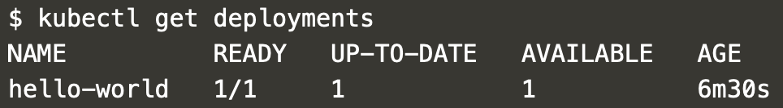
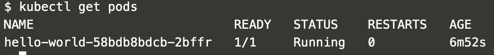
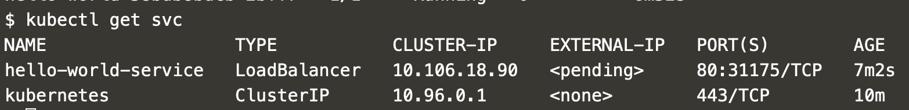

## Building A Simple Hello World App

## Introduction

In the first part of this article, you learnt about the Kubernetes architecture and what each basic component is and what they do. In this part we will be deploying a simple application on Kubernetes, this will give you a sense of how it works.

## Prerequisites

* One bare metal server running Ubuntu, quickly setup one on MaxiHost
* Docker installed on the host machine, you can find the installation steps in our [Docker for Beginners]() article.

## Step 1 - Install Kubernetes

### Install Kubernetes Control Tool (Kubectl)

Kubectl is the tool which would be used for interacting with the kubernetes control plane. run the following to have `kubectl` installed.

```bash
curl -LO https://storage.googleapis.com/kubernetes-release/release/`curl -s https://storage.googleapis.com/kubernetes-release/release/stable.txt`/bin/linux/amd64/kubectl
chmod +x ./kubectl
sudo mv ./kubectl /usr/local/bin/kubectl
```

This will download and install the latest stable release of `kubectl` on your host machine. Next, verify if `kubectl` is properly installed by checking for its version number.

```bash
kubectl version
```

If the installation was successful it will return a response similar to this:

```
Client Version: version.Info{Major:"1", Minor:"15", GitVersion:"v1.15.3", GitCommit:"2d3c76f9091b6bec110a5e63777c332469e0cba2", GitTreeState:"clean", BuildDate:"2019-08-19T11:13:54Z", GoVersion:"go1.12.9", Compiler:"gc", Platform:"linux/amd64"}
```

### Install Minikube

To run Minikube, you need an hypervisor to run the cluster VM (Virtual Machine). An hypervisor is a tool used to control virtual machines. A common hypervisor is `VirtualBox`, and it will be used in this tutorial. To install `VirtualBox` run:

```bash
sudo apt-get update
sudo apt-get install virtualbox
```

Once that is done, you can now install `minikube` by running the following commands:

```bash
curl -Lo minikube https://storage.googleapis.com/minikube/releases/latest/minikube-linux-amd64 \ && chmod +x minikube

sudo install minikube /usr/local/bin
```

This will download the latest release of `minikube` and installs on the server. Once that is done we need to start `minikube`, you can start the kubernetes cluster on minikube using this command:

```bash
minikube start
```


This would start the kubernetes cluster alongside an API on the default `8080` port on localhost.


## Deploying an application to Kubernetes

To start off deploying the application, we need to make a deployment. A deployment as previously explained is a kubernetes object for a cluster of pods.

In Kubernetes, we use containers to spin up applications and as such we'd need a container to run in our deployment.

For this example, we'd be using the image from the docker beginner guide which has been uploaded to this  repo: [`ichtrojan/php-hello-world`](https://hub.docker.com/r/ichtrojan/php-hello-world)

When deploying applications, we deploy them to a path called a namespace. A namespace is an abstraction of a sandbox which is used to break down the same application in different zones, we can do this for testing purposes such as A/B testing, where we might use different configurations but need both applications running to infer what the difference in runtime there might be.

If a namespace is not specified, Kubernetes by default uses the `default` namespace.

Here's a sample deployment `yaml` template using the `ichtrojan/php-hello-world` image.

```yaml
apiVersion: apps/v1
kind: Deployment
metadata:
  name: hello-world
#  namespace: random-namespace # it can be anything random
spec:
  selector:
    matchLabels:
      run: hello-world
  replicas: 1 # we want 1 instances of this running
  strategy:
    rollingUpdate: # this ensures that if we add a new update, we only have one application down
      maxSurge: 1
      maxUnavailable: 1
    type: RollingUpdate
  template:
    metadata:
      labels:
        run: hello-world
    spec:
      containers:
      - name: php-hello-world
        image: ichtrojan/php-hello-world
        imagePullPolicy: IfNotPresent
        readinessProbe:
          httpGet: # Calls an endpoint and check if returns a status code < 400
            path: /
            port: liveness-port
          initialDelaySeconds: 5
          timeoutSeconds: 1
          periodSeconds: 15
        livenessProbe: # Checks if the port is open on the container
          tcpSocket:
            port: liveness-port
          initialDelaySeconds: 5
          timeoutSeconds: 1
          periodSeconds: 15
        resources: # We can restrict how much resources we'd like to give to containers also
          requests:
            cpu: 100m
            memory: 100Mi
        ports:
        - name: liveness-port
          containerPort: 80
```

You can apply this by running the command:

```bash
kubectl apply -f php-hello-world-deployment.yaml
```

You can likewise check the status using the following commands:



And we can view further the pods which constitute the deployment



## Exposing our Deployment using Services

When we create a deployment, we start our application using containers that run within our cluster and will do so using the configuration which we have specified. To access the deployment, we need to create a service.

A service is an entrypoint to our application which defines which port should be open and how it can be accessed. What this means is that a service is binded to a port, which is very true. So for each port which is open in our application, we have an accompanying service to open it to the world in the Kubernetes cluster.

If you rememeber that kubernetes is a cluster, that means that we can access our application from any node using the service name. This defeats the purpose of knowing which IP and port the application is deployed on.

If we have an application that we don't need exposed, we  don't create a service for the application and it's securely hosted on the cluster.

When it comes down to services, we can have the following types:

NodePort - This is the default host mapping, we basically host the port of our application on some arbitrary port in the range of 30000-32767. All pods in our cluster have a node port which all requests to the service get forwarded to.

ClusterIP - When we have more than one replica which we'd like to forward traffic to, we use a clusterIP. This assigns the entire deployment a clusterIP which internally load balances all the requests to the pods which were previously created by the deployment, this service type has no NodePort. This ClusterIP can only be accessed internally and is not open to the world

LoadBalancer - This is similar to the ClusterIP service type but exposes the traffic outside the cluster. For a loadbalancer to work, we need a load balancer controller installed on the network. There are some software controllers such as [MetalLB](https://metallb.universe.tf) which allow us use load balancers on-prem without purchasing load balancing equipment like F5-Big IP. In general, such controllers are provided by cloud providers so most load balancer setups would happen on a cloud service such as GKE or AKS.

Enough of the talk, let's write a service for our hello-world application.


```yaml
apiVersion: v1
kind: Service
metadata:
  name: hello-world-service
# namespace: random-namespace # you can likewise add a namespace to a service too
spec:
  selector:
    run: hello-world
  ports:
  - protocol: TCP
    port: 80
    targetPort: 80
    name: http
  type: LoadBalancer # We use a load balancer cause we want to access it outside the cluster
```

Once you've written the service, you can apply it using:

```bash
kubectl apply -f php-hello-world-service.yaml
```



To test the service as we have no load balancer controller, we can use the minikube application to send requests to our service

```bash
minikube service hello-world-service
```

If you want to try it some other way, you can always curl the ClusterIP too.
```bash
curl $(kubectl get svc hello-world-service -o=jsonpath='{.spec.clusterIP}')
```

This would return the response from the container which has the format
```html
<!DOCTYPE html>
<html>
  <head>
    <meta charset="utf-8">
    <title>Hello World</title>
  </head>
  <body>
    Hello World. The time is "<time>"  </body>
</html>
```

 where \<time> is the current time.

If that worked, then you've successfully created a deployment and matched it to a service.

For those on linux wanting to experiment a lot more than the previous guide offers, another one was made with linux in particular. All the steps for setting it up on a linux environment are outlined here also:

[https://github.com/Tiemma/devfest-kubernetes-demo](https://github.com/Tiemma/devfest-kubernetes-demo)

## Conclusion

You've successfully learnt about the internals of kubernetes and hopefully tested and deployed an application both on the cloud and on your computer with minikube.

For those willing to cover a lot more content than just the basics: Check out the slides [here](https://docs.google.com/presentation/d/1dz5KB_ojadj4paf2H6TJvcj6QmcU6lZQMytdGkwUo9M/edit?usp=sharing) and don't be afraid to leave a comment or two.
